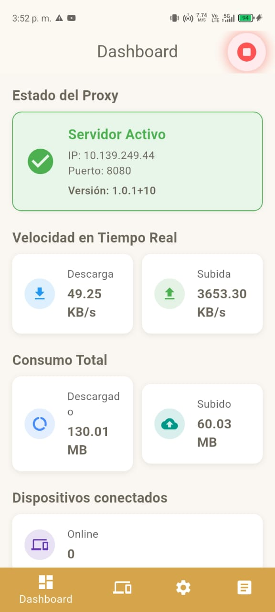
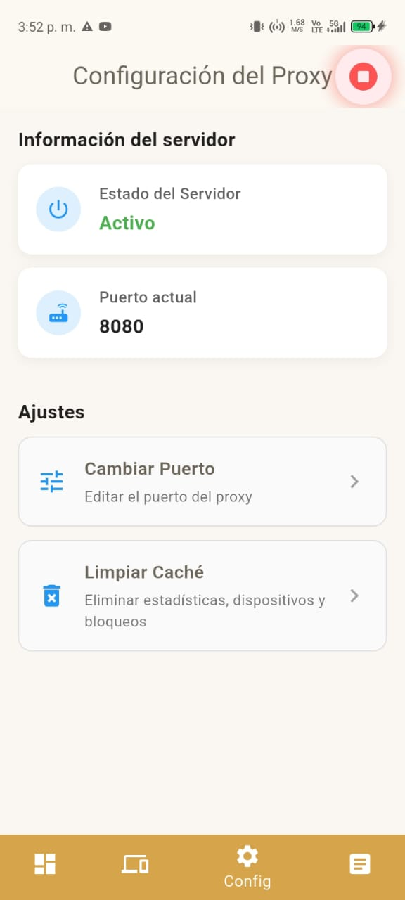
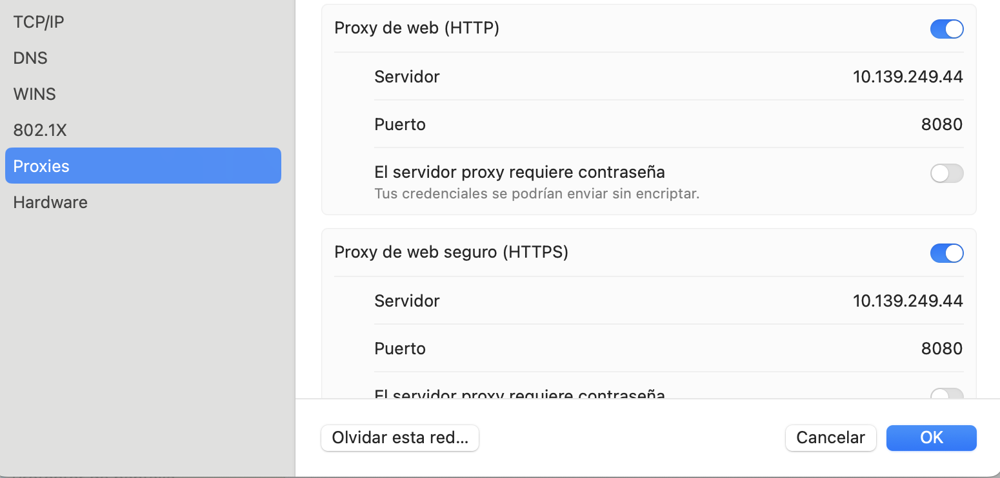

---

# 📡 ProxyApp – Proof of Concept (PoC)

ProxyApp es una aplicación móvil desarrollada como **prueba de concepto (PoC)**, cuyo objetivo fue validar si un **smartphone con datos móviles** puede actuar como **servidor proxy** para otros dispositivos conectados a su red Wi-Fi local, incluso cuando esos otros dispositivos **no poseen Internet** o tienen restricciones de hotspot.

Este proyecto no nació como un producto final, sino como un experimento técnico para validar:

* 🚀 La creación de un servidor **HTTP/HTTPS Proxy** funcionando directamente en un teléfono móvil
* 🔌 La **conexión simultánea** de múltiples dispositivos a través del Wi-Fi local (hotspot)
* 📶 La **ejecución del proxy en segundo plano** mediante servicios foreground
* 📊 El **monitoreo en tiempo real** del tráfico, velocidad, datos consumidos y dispositivos conectados
* 👥 El **control de dispositivos**, incluyendo bloqueo por IP
* 🧪 La capacidad real de un smartphone para compartir **todos los datos del plan móvil**, incluso si el operador aplica límites al hotspot

Aunque fue construido como un PoC, la aplicación **es funcional** y queda disponible para quien quiera probarla.
No se ofrecen garantías de estabilidad, seguridad o mantenimiento.

---

# 🎯 Objetivo especial del PoC

## Acceder al 100% de los datos móviles (incluso con límites de hotspot)

Muchos operadores móviles diferencian entre:

| Tipo de datos                   | Descripción                                   |
| ------------------------------- | --------------------------------------------- |
| **Datos del plan total**        | Ej.: 100 GB disponibles realmente en la SIM   |
| **Datos compartidos (hotspot)** | Ej.: solo 20 GB permitidos al activar hotspot |

Normalmente, al activar el punto de acceso Wi-Fi, los dispositivos conectados **solo pueden usar la cuota del hotspot**.

### ✔️ Resultado técnico del PoC

ProxyApp **no utiliza** el mecanismo estándar del hotspot para enviar el tráfico a Internet.
En lugar de eso:

→ enruta todas las peticiones hacia Internet mediante **la conexión móvil primaria**,
→ permitiendo usar **el 100% de los datos reales del plan**, sin quedar limitados por la cuota de hotspot.

### 🟢 Conclusión

Sí, es viable que los dispositivos conectados al Wi-Fi del teléfono anfitrión **usen todos los datos del plan móvil**, saltando la restricción tradicional del hotspot.

---

# ⚠️ Compatibilidad: Apps que respetan la configuración de Proxy

ProxyApp funciona **solo para tráfico HTTP y HTTPS** enviado por aplicaciones que sí respetan la configuración de proxy del sistema operativo.

Esto significa:

### ✔ Apps que generalmente funcionan

* Chrome / Firefox / Edge
* Safari y apps basadas en networking nativo de macOS
* Aplicaciones Android que usan la configuración de red del sistema
* Windows Update (según versión)
* Curl, Wget, Git, Brew, APT, YUM, etc. configurando proxy

---

# 📡 Información mostrada dentro de ProxyApp

Dentro de la aplicación verás siempre:

### **IP local del servidor**

La dirección asignada al teléfono anfitrión dentro de su propia red Wi-Fi.
Ejemplo:

```
10.139.249.44
```

### **Puerto del proxy**

El puerto de escucha configurado para HTTP/HTTPS:

```
8080
```

Ambos valores deben copiarse exactamente en los dispositivos cliente.

### Ilustraciones

* **Dashboard del proxy en Android**
  

* **Configuración del proxy manual en Android**
  

---

# 📱 Cómo usar ProxyApp paso a paso

A continuación se explica el proceso completo para que otros dispositivos naveguen usando los datos móviles del teléfono anfitrión.

---

# 🟩 1. Preparación del teléfono anfitrión (el que SÍ tiene Internet)

Este teléfono:

* Tiene el plan de datos móviles
* Ejecutará ProxyApp como servidor
* Compartirá Internet
* Debe activar el hotspot

### ✔ Pasos

### **1️⃣ Activar el hotspot / zona Wi-Fi portátil**

Antes de abrir ProxyApp:

1. Ir a: **Configuración → Hotspot / Zona Wi-Fi personal**
2. Activar hotspot
3. Dejar el teléfono emitiendo la red Wi-Fi

Ejemplo:

```
Red: MiHotspot
Contraseña: 12345678
```

➡ **El hotspot debe permanecer encendido**, ya que la conexión de los demás dispositivos pasa por allí.

---

### **2️⃣ Instalar y abrir ProxyApp**

1. Instalar ProxyApp
2. Abrir la app
3. Tocar **Iniciar servidor**

---

### **3️⃣ Verificar que el servidor esté activo**

La app mostrará:

* “Servidor Activo”
* La **IP local**
* El **Puerto** del proxy

Ejemplo:

```
IP del Proxy: 10.139.249.44
Puerto: 8080
```

➡ Estos valores se usan en los dispositivos cliente.

---

# 🟦 2. Preparación de los dispositivos cliente (sin Internet)

Los dispositivos cliente pueden ser:

* Teléfonos Android
* iPhones
* Laptops Windows
* macOS
* Linux
* Tablets

Estos dispositivos **no tienen Internet propio**, pero sí pueden conectarse al Wi-Fi del teléfono anfitrión.

---

### ✔ Pasos

### **1️⃣ Conectarse a la red Wi-Fi del anfitrión**

1. Ir a Wi-Fi
2. Seleccionar la red del hotspot
3. Conectarse

Ejemplo:

```
MiHotspot
```

---

### **2️⃣ Configurar el Proxy HTTP/HTTPS manualmente**

Cada sistema operativo tiene su propia ubicación del ajuste.

En absolutamente todos los casos deberás ingresar:

```
Proxy host name: [IP mostrada en ProxyApp]
Proxy port:      [Puerto mostrado en ProxyApp]
```

Ejemplo:

```
Proxy host name: 10.139.249.44
Proxy port: 8080
```

Una vez configurado, el dispositivo cliente enviará todo el tráfico HTTP/HTTPS al teléfono anfitrión, que lo redirigirá a Internet.

---

# 🌍 Configuración por plataforma

## 📱 Android (cliente)

1. Conectarse a la red Wi-Fi del servidor
2. Mantener presionado → **Modificar red**
3. Mostrar opciones avanzadas
4. En **Proxy**, elegir: **Manual**
5. Configurar host y puerto
6. Guardar

---

## 🖥 Windows 10 / 11

1. Inicio → Configuración
2. Red e Internet
3. Proxy
4. Activar **Usar un servidor proxy**
5. Ingresar host y puerto
6. Guardar

---

## 🍏 macOS

1. Preferencias del Sistema → Red
2. Seleccionar Wi-Fi
3. Avanzado...
4. Pestaña **Proxies**
5. Marcar **HTTP** y **HTTPS**
6. Configurar host y puerto
7. Aplicar



---

## 🐧 Linux (Ubuntu/Debian – GNOME)

1. Configuración
2. Red
3. Proxy
4. Seleccionar **Manual**
5. Configurar host y puerto

---

## 📱 iOS (iPhone / iPad)

1. Ajustes → Wi-Fi
2. Seleccionar la red
3. Ir al final → **Proxy HTTP → Manual**
4. Configurar host y puerto
5. Guardar

---

# ⚖️ Licencia – MIT

El proyecto utiliza la Licencia MIT:

* Uso libre personal y comercial
* Modificación y redistribución permitidos
* El autor no se hace responsable por daños, fallos o mal uso

---

# 📝 Descargo de responsabilidad

Este proyecto:

* No garantiza estabilidad o continuidad
* No asegura privacidad ni protección de datos
* No está diseñado para producción
* Fue creado para aprendizaje y experimentación

El autor no asume responsabilidad por pérdidas o daños derivados del uso.

---

# 📦 Instalación rápida (desarrolladores)

```bash
git clone https://github.com/josmejia2401/proxyapp.git
flutter pub get
flutter run
```

---

# 📬 Contacto

Se aceptan ideas, mejoras, PRs y forks para expandir este PoC.

---
